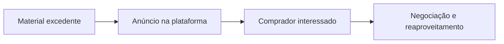

## Instituição

**Universidade Federal do Tocantins (UFT)**  
Curso: Ciência da Computação  
Disciplina: Desenvolvimento web mobile — 2026.2  
Professor: Dr. Jackson Gomes de Souza


## Equipe

| Integrante | GitHub |
|---|---|
| Breno Borges | [@Brenoborgesbr](https://github.com/Brenoborgesbr) |
| José Guilherme Ferreira Sobrinho | [@joseguifs](https://github.com/joseguifs) |
| Matheus Felipe Lopes Valadares | [@MatheusF-del](https://github.com/MatheusF-del) |
| Mario Felipe Bastos Noleto | [@Mario-FelipeBN](https://github.com/Mario-FelipeBN) |

## Sobre o projeto

O **ObraCircular** é uma plataforma digital voltada à compra, venda e reaproveitamento de materiais excedentes de obras e reformas.

A solução conecta pessoas, profissionais, lojas e construtoras que possuem materiais sem uso a compradores que procuram produtos em pequenas quantidades ou por preços mais acessíveis.

O projeto será validado inicialmente em **Palmas, Tocantins**, mas foi pensado para funcionar em outras cidades brasileiras.

## Contexto

Construções e reformas frequentemente deixam materiais que ainda podem ser utilizados, como pisos, telhas, tijolos, tubos, portas, janelas, peças elétricas e hidráulicas. Em muitos casos, esses itens permanecem armazenados por tempo indeterminado ou são descartados.

Ao mesmo tempo, outras pessoas precisam comprar exatamente esses materiais, às vezes em quantidades pequenas ou em modelos que já não são encontrados nas lojas.

Em Palmas, a construção civil está entre os setores de maior expansão. Segundo o Observatório Econômico da Prefeitura, **807 novas empresas ligadas ao setor foram abertas entre janeiro e maio de 2026**, incluindo negócios de alvenaria, pintura, instalações elétricas e serviços especializados.

O ObraCircular nasce para aproximar esses dois lados e transformar excedentes em novas oportunidades de economia e geração de renda.

## Problema

Atualmente, a negociação de sobras de materiais costuma acontecer de forma informal, por meio de grupos de mensagens, redes sociais ou contatos pessoais. Isso gera dificuldades como:

- pouca visibilidade dos materiais disponíveis;
- dificuldade para encontrar modelos e medidas compatíveis;
- informações incompletas sobre quantidade e conservação;
- materiais úteis armazenados ou descartados;
- dificuldade para comparar preços e localização;
- falta de um ambiente especializado para esse tipo de negociação.

## Solução proposta

O ObraCircular oferece um ambiente especializado em materiais de construção, permitindo que o vendedor publique informações técnicas do produto e que o comprador pesquise por categoria, localização, preço, quantidade e estado de conservação.



Além dos anúncios, a plataforma poderá permitir que compradores cadastrem materiais que estão procurando. Quando um item compatível for publicado, o usuário será notificado.

## Objetivos

### Objetivo geral

Facilitar o reaproveitamento e a comercialização de materiais excedentes de obras, reduzindo custos, desperdícios e descarte desnecessário.

### Objetivos específicos

- conectar vendedores e compradores de materiais de construção;
- facilitar a busca por produtos específicos e em pequenas quantidades;
- permitir que vendedores recuperem parte do valor investido;
- ajudar compradores a economizar em construções e reformas;
- incentivar práticas de economia circular na construção civil;
- criar oportunidades para profissionais e transportadores locais;
- desenvolver um modelo replicável em outras cidades.

## Público-alvo

### Vendedores

- moradores que concluíram uma construção ou reforma;
- pedreiros, pintores, eletricistas e encanadores;
- arquitetos e engenheiros;
- lojas de materiais de construção;
- construtoras e empresas de reforma.

### Compradores

- pessoas construindo ou reformando;
- profissionais da construção civil;
- pequenos empreiteiros;
- empresas que precisam de materiais em menor quantidade;
- pessoas procurando peças de reposição ou modelos fora de linha.

### Parceiros

- transportadores e serviços de frete;
- cooperativas e iniciativas de reaproveitamento;
- lojas e fornecedores do setor;
- profissionais especializados.

## Como funciona

1. O vendedor cria uma conta e publica o material excedente.
2. O anúncio informa categoria, quantidade, preço, localização, medidas e fotografias.
3. O comprador pesquisa ou recebe um alerta de compatibilidade.
4. O comprador envia uma proposta ou demonstra interesse.
5. As partes combinam pagamento, retirada ou entrega.
6. Após a negociação, o anúncio é marcado como vendido e os participantes podem registrar uma avaliação.

## Informações específicas dos materiais

Por ser uma plataforma especializada, os anúncios poderão utilizar campos diferentes conforme a categoria:

| Categoria | Exemplos de informações |
| --- | --- |
| Pisos e revestimentos | Marca, modelo, lote, dimensões e metragem |
| Tintas | Cor, volume, validade e condição da embalagem |
| Portas e janelas | Material, altura, largura e estado de conservação |
| Tubos e conexões | Material, diâmetro, comprimento e quantidade |
| Telhas | Modelo, dimensões, material e quantidade |
| Madeira | Tipo, espessura, comprimento e tratamento |
| Materiais elétricos | Marca, especificação, quantidade e condição |
| Louças e metais | Modelo, medidas, cor e estado de conservação |

## Funcionalidades previstas

### Conta e perfil

- cadastro e autenticação;
- perfil de pessoa física ou empresa;
- dados de contato e localização aproximada;
- histórico de anúncios, compras e avaliações.

### Anúncios

- cadastro, edição e encerramento de anúncios;
- upload de fotografias;
- categorias e atributos específicos;
- quantidade disponível;
- indicação de retirada ou possibilidade de entrega;
- estados `disponível`, `reservado` e `vendido`.

### Busca e descoberta

- pesquisa por nome e descrição;
- filtros por categoria, preço, localização e condição;
- ordenação por preço, distância ou data;
- favoritos;
- visualização de materiais próximos.

### Negociação

- envio, aceitação e recusa de propostas;
- reserva temporária do material;
- registro do andamento da negociação;
- avaliação entre comprador e vendedor.

### Alerta de procura

- cadastro de um material desejado;
- definição de categoria, quantidade, características e distância máxima;
- notificação quando um anúncio compatível for publicado.

### Administração

- gerenciamento de usuários e anúncios;
- moderação de conteúdo;
- recebimento e análise de denúncias;
- gerenciamento de categorias;
- acompanhamento de indicadores da plataforma.

## Funcionalidades futuras

- pagamentos dentro da plataforma;
- integração com serviços de entrega e frete;
- cálculo estimado de transporte;
- mapa de anúncios próximos;
- chat em tempo real;
- planos profissionais;
- anúncios patrocinados;
- recomendação automática de materiais compatíveis;
- perfil de profissionais da construção civil;
- expansão para outras cidades e estados.


## Proposta de valor

| Público | Valor oferecido |
| --- | --- |
| Vendedor | Recuperar parte do investimento e liberar espaço de armazenamento |
| Comprador | Encontrar materiais mais baratos, específicos ou em pequenas quantidades |
| Profissional | Encontrar materiais e potenciais clientes |
| Construtora | Melhorar a gestão de excedentes e apoiar práticas sustentáveis |
| Sociedade | Reduzir desperdício e descarte de materiais ainda utilizáveis |

## Diferenciais

- especialização em materiais de construção;
- atributos técnicos específicos para cada categoria;
- venda de pequenas quantidades;
- alerta de materiais procurados;
- foco inicial no mercado local;
- integração futura com profissionais e transportadores;
- possibilidade de expansão nacional.

## Regras e cuidados

Para preservar a confiança e a segurança da comunidade, a plataforma deverá estabelecer algumas regras:

- o anúncio deverá apresentar descrição e fotografias reais;
- o vendedor será responsável por informar corretamente a condição do material;
- produtos vencidos, ilícitos, perigosos ou sem identificação não serão permitidos;
- materiais estruturais usados poderão ser proibidos ou submetidos a regras específicas;
- a plataforma não certificará a qualidade técnica dos produtos;
- comprador e vendedor deverão verificar o material antes de concluir a negociação;
- denúncias poderão resultar na suspensão do anúncio ou da conta;
- dados pessoais deverão ser coletados somente quando necessários.

## Executando o backend

### Requisitos

- Python 3.11 ou superior;
- PostgreSQL em execução;
- banco de dados `obra_circular` criado.

### Configuração

No PowerShell, a partir da raiz do repositório:

```powershell
cd backend
python -m venv venv
.\venv\Scripts\Activate.ps1
python -m pip install -r requirements.txt
Copy-Item .env.example .env
```

Revise o `DATABASE_URL` do arquivo `backend/.env` com o usuário e a senha do seu PostgreSQL. Em seguida, aplique as migrations e inicie a API:

```powershell
python -m alembic upgrade head
fastapi dev app/main.py
```

A documentação interativa estará disponível em `http://127.0.0.1:8000/docs` e o endpoint de saúde em `http://127.0.0.1:8000/health`.

### Estrutura das rotas

As rotas ficam em `backend/app/api/routes`. Os módulos de `usuarios`, `categorias`, `enderecos` e `anuncios` já estão preparados para receber os endpoints sob o prefixo `/api/v1`.
